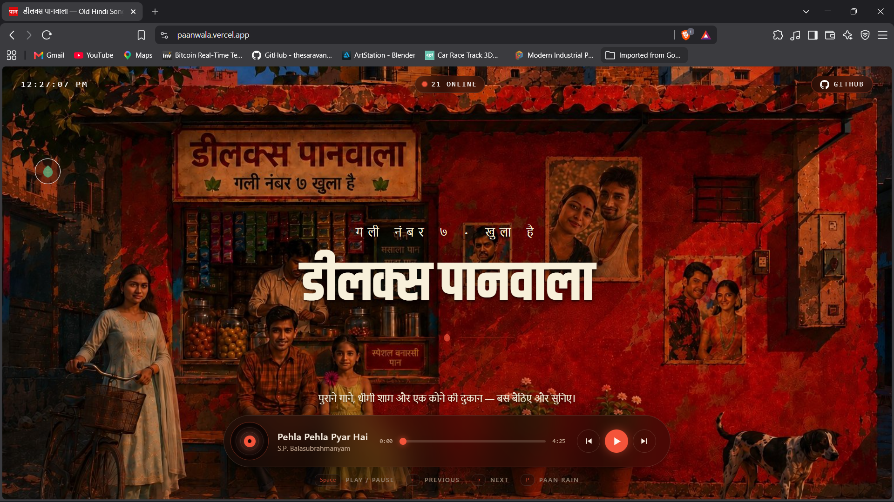
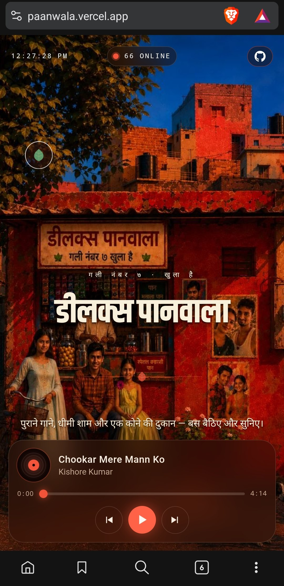

# 🎵 Nostalgia Radio

> A retro-inspired music experience inspired by classic Indian cinema, old Hindi songs, and the atmosphere of a traditional paan shop.

🌐 **Live Demo:** https://paanwala.vercel.app

💻 **GitHub:** https://github.com/dexterav/nostalgia-radio

---

## ✨ Overview

Nostalgia Radio is a responsive web-based music experience designed around a nostalgic Indian street and paan-shop aesthetic.

The project combines a custom visual environment with a functional music player, playlist navigation, keyboard shortcuts, responsive layouts, and production deployment.

The goal was to create an immersive experience that feels like sitting in a small old-school paan shop while listening to classic Hindi music.

---

## 🚀 Features

- 🎵 Custom audio player
- ▶️ Play / Pause controls
- ⏮️ Previous and Next track navigation
- ⏱️ Track progress and duration
- 🎚️ Seekable progress bar
- 🎼 50-song playlist
- ⌨️ Keyboard shortcuts
- 📱 Responsive mobile layout
- 🖥️ Desktop layout
- 🖼️ Separate wide and tall background scenes
- 🍃 Interactive paan-leaf rain animation
- 🎨 Custom nostalgic Indian street-inspired design
- 🌐 Production deployment with Vercel

### ⌨️ Keyboard Shortcuts

| Key | Action |
|-----|--------|
| `Space` | Play / Pause |
| `←` | Previous song |
| `→` | Next song |
| `P` | Paan-leaf rain |

---

## 🛠️ Tech Stack

- React
- TypeScript
- Vite
- Tailwind CSS
- HTML5 Audio API
- Git & GitHub
- Git LFS
- Vercel

---

## 🎯 Technical Highlights

### Responsive Design

The interface is designed for both desktop and mobile screens using responsive layouts and separate visual assets for wide and tall displays.

### Custom Music Player

The player uses the HTML5 Audio API and provides:

- Play / Pause
- Previous / Next
- Track progress
- Track duration
- Seek functionality
- Automatic next-track playback
- Missing-track error handling

### Keyboard Interaction

Global keyboard controls were implemented for faster interaction while avoiding interference with editable fields.

### Production Deployment

The application is deployed to Vercel and tested in a real production environment.

### Git LFS

The production version uses Git Large File Storage (Git LFS) to manage the large MP3 assets efficiently.

---

## 📂 Project Structure

```text
nostalgia-radio/
├── public/
│   └── bg/
│       ├── scene-tall.png
│       └── scene-wide.png
├── src/
│   ├── components/
│   ├── data/
│   ├── lib/
│   ├── routes/
│   └── styles.css
├── .gitattributes
├── .gitignore
├── package.json
├── vite.config.*
└── README.md
```

---

---

## 📸 Screenshots

### 🖥️ Desktop

A cinematic Indian street/paan-shop inspired interface with an integrated custom music player.



### 📱 Mobile

A responsive tall-screen layout designed specifically for mobile viewing.



---

## 💡 What I Learned

Through this project I worked with:

- React component architecture
- TypeScript
- Responsive UI development
- HTML5 audio playback
- Git and GitHub workflows
- Git LFS for large files
- Vercel deployment
- Production debugging
- Handling differences between local development and production environments

---

## 🔮 Future Improvements

- 🎼 Expand the music library
- 🔎 Add playlist search
- ❤️ Add favorite tracks
- 📋 Create custom playlists
- 🎚️ Add volume/equalizer controls
- 🌙 Add additional visual themes
- 📊 Add playback analytics

---

## 👨‍💻 Developer

**Abhishek Kumar**

B.Tech — Electronics & Communication Engineering, 2026

Interested in:

- Cloud Computing
- DevOps
- Python
- Linux
- Web Development
- Automation

---

⭐ If you like the project, feel free to explore the repository and try the live demo.

**Live Demo → https://paanwala.vercel.app**